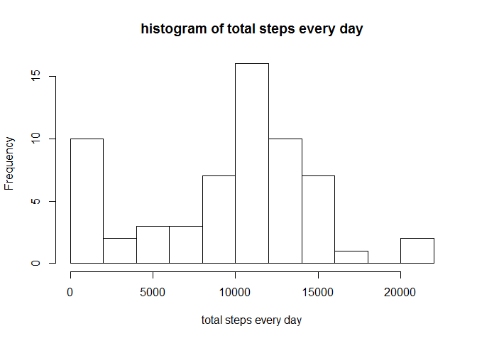
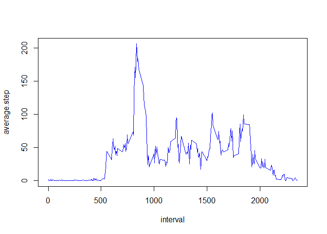
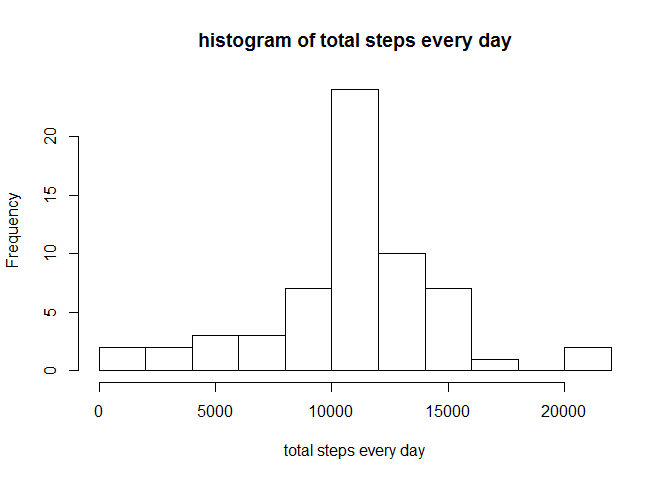
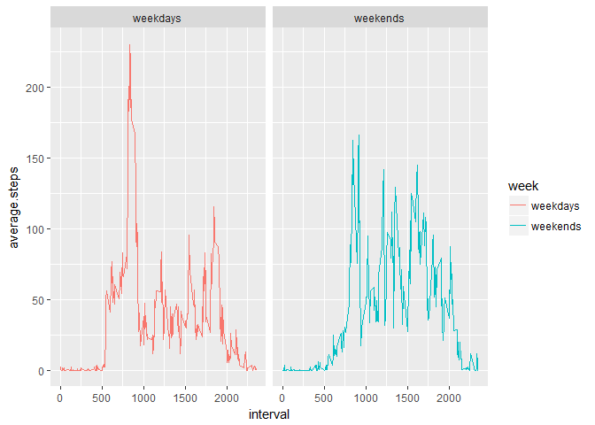

step1: read the data file in to R
---------------------------------

    data<- read.csv("activity.csv")

step2: calculate the mean total number of steps taken per day
-------------------------------------------------------------

mean total number=total number of steps/number of days

Let's calculate the total number of steaps taken every day. It is stored
in the data frame total.steps.daily

    # calculate the sum of steps by date
    total.steps.daily<- sapply(split(data$steps,data$date),function(x){sum(x,na.rm = TRUE)})
    total.steps.daily<-data.frame(toal.steps=total.steps.daily)
    total.steps.daily[,2]<-data.frame(date=sapply(split(data$date,data$date),function(x){x[1]}))
    total.steps.daily$date=as.Date(as.character(total.steps.daily$date),"%Y-%m-%d")

Then a histogram about the total number of steps taken every day is
shown

    hist(total.steps.daily$toal.steps,breaks = 10,xlab = "total steps every day",main = "histogram of total steps every day")

The mean of the total number of steps every day is:

     mean(total.steps.daily$toal.steps,na.rm = TRUE)

    ## [1] 9354.23

The median of the total number of steps every day is

    median(total.steps.daily$toal.steps,na.rm = TRUE)

    ## [1] 10395

step3: find the average daily activity pattern
----------------------------------------------

If we calculate the mean steps per interval, and plot the mean versus
intervals, we are going to see this figure.

    interval.steps<-data.frame(average.step=sapply(split(data$steps,as.factor(data$interval)),function(x){mean(x,na.rm = TRUE)}))
    interval.steps[,2]<-data.frame(interval=sapply(split(data$interval,as.factor(data$interval)),function(x){x[1]}))
    with(interval.steps,plot(interval, average.step,type = "l",col="blue"))

The interval with the maximal of steps is

    interval.steps$interval[which.max(interval.steps$average.step)]

    ## [1] 835

step4: imputing missing values
------------------------------

The number of missing values in the dataset is:

    nrow(data)-sum(complete.cases(data))

    ## [1] 2304

If we use the mean value of each interval to fill in the missing places,
we would have the new dataset y:

    y<-data
    y<-merge(y,interval.steps,by="interval")
    index<-complete.cases(y)
    y$steps[!index]<-y$average.step[!index]    ##fill in the new data

If we redo the calculation in Step 1, the histogram will be,

     total.steps.daily<- sapply(split(y$steps,y$date),function(x){sum(x,na.rm = TRUE)})
     total.steps.daily<-data.frame(toal.steps=total.steps.daily)
     total.steps.daily[,2]<-data.frame(date=sapply(split(y$date,y$date),function(x){x[1]}))
     total.steps.daily$date=as.Date(as.character(total.steps.daily$date),"%Y-%m-%d")

     hist(total.steps.daily$toal.steps,breaks = 10,xlab = "total steps every day",main = "histogram of total steps every day")

The mean of the total number of steps every day is:

     mean(total.steps.daily$toal.steps,na.rm = TRUE)

    ## [1] 10766.19

The median of the total number of steps every day is

    median(total.steps.daily$toal.steps,na.rm = TRUE)

    ## [1] 10766.19

They are all different from the results in Step 1. The mean and the
median are larger.

Step 5: Are there differences in activity patterns between weekdays and weekends?
---------------------------------------------------------------------------------

Let's creat a new factor variable in data frame y to indicate whether
that day is weekday or weekend.

    y$date<-as.Date(as.character(y$date))
    index1<-is.element(weekdays(y$date),c("Saturday","Sunday"))
     y$week<-NA
    y$week[index1]<-"weekends"
    y$week[!index1]<-"weekdays"
    y$week<-as.factor(y$week)
    head(y)

    ##   interval    steps       date average.step     week
    ## 1        0 1.716981 2012-10-01     1.716981 weekdays
    ## 2        0 0.000000 2012-11-23     1.716981 weekdays
    ## 3        0 0.000000 2012-10-28     1.716981 weekends
    ## 4        0 0.000000 2012-11-06     1.716981 weekdays
    ## 5        0 0.000000 2012-11-24     1.716981 weekends
    ## 6        0 0.000000 2012-11-15     1.716981 weekdays

The patterns in Step3 are splited by whether it is on weekdays or
weekends.

    z<-lapply(split(y,y$week),function(x){aggregate(x$steps,by=list(x$interval),FUN=mean)})
    z[[1]]$week<-"weekdays"
    z[[2]]$week<-"weekends"
    average.steps.by<-rbind(z[[1]],z[[2]])
    names(average.steps.by)<-c("interval","average.steps","week")
    library("ggplot2")
    qplot(data = average.steps.by,x=interval,y=average.steps,facets = .~week,geom = "line",color=week)

